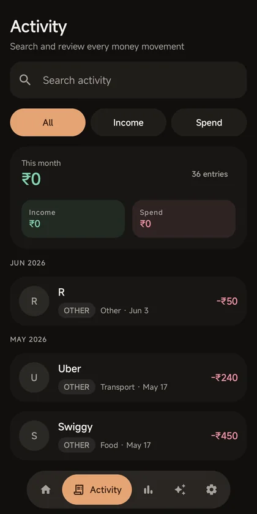
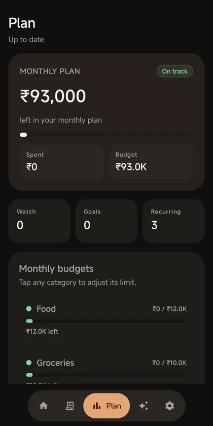
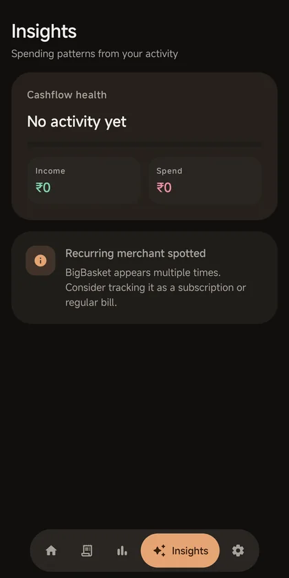

# PennyRush

See where the money actually went, without handing your statements to an
advertising business.

PennyRush is a personal finance tracker with a native Android app, a companion
web app, and one Supabase backend. Statement files and receipt images are read
for the fields you choose to save and then dropped. What is stored is the entry
itself: amount, date, merchant, note, type, category.

[](LICENSE)
[](android/app/build.gradle.kts)
[](web)
[](#privacy)

<!-- media:start -->

<p align="center">
  
</p>

<h3 align="center">Your money, in one private hub.</h3>

## Screenshots

<table>
  <tr>
    <td width="25%" valign="top">
      
      <sub><b>Home.</b> The balance, the quick actions, and what happened last.</sub>
    </td>
    <td width="25%" valign="top">
      
      <sub><b>Activity.</b> Everything you have saved, searchable.</sub>
    </td>
    <td width="25%" valign="top">
      
      <sub><b>Plan.</b> Budgets showing what is left, not what is gone.</sub>
    </td>
    <td width="25%" valign="top">
      
      <sub><b>Insights.</b> No verdict at all when there is no activity to judge.</sub>
    </td>
  </tr>
</table>

<sub>Captured from the app running on a physical device, with the status and
navigation bars cropped out, against a test account whose most recent activity
is a couple of months old. That is why the merchant ranking is absent and
Insights reads "No activity yet".</sub>

<!-- media:end -->

## Privacy

The claim is narrow enough to keep:

- **CSV import** parses the file in your browser. The raw statement is never
  uploaded to storage.
- **Receipt scan** reads the image to fill in the entry for you to check. The
  entry is saved; the image is not kept afterwards.
- **No advertising SDKs, no paid analytics SDKs, no tracking pixels**, and none
  of your data is sold.
- **Export everything as CSV** whenever you want it, and delete your account
  and its data from either client.

The one host the app talks to is its own Supabase project, plus Google for
sign-in. Full policy: [privacy.signalizeai.org/pennyrush](https://privacy.signalizeai.org/pennyrush).

## What Is In This Repo

- `web/`: Next.js App Router companion app with authentication, activity dashboard, manual entries, CSV import, privacy/terms pages, and export/delete controls.
- `android/`: Kotlin + Jetpack Compose app with Home, Activity, Plan, Insights, Account, manual entry, import, receipt scan, budgets/goals, alerts, export, and delete controls.
- `shared/`: Shared TypeScript contract types for web and Supabase functions.
- `supabase/`: Local-only schema/functions workspace. It is intentionally ignored so linked project state and secrets are not pushed.
- `docs/`: Architecture, database, privacy, Play Store listing, and release checklist material.

## Local Setup

```bash
npm install
npm run web:dev
```

Create `.env.local` from `.env.example`:

```bash
NEXT_PUBLIC_SUPABASE_URL=...
NEXT_PUBLIC_SUPABASE_ANON_KEY=...
PENNYRUSH_SUPABASE_URL=...
PENNYRUSH_SUPABASE_ANON_KEY=...
```

Android local build:

```bash
cd android
./gradlew :app:assembleDebug
```

Release verification:

```bash
npm audit
npm run web:test
npm run web:lint
npm run web:typecheck
npm run web:build
cd android
./gradlew :app:compileDebugKotlin
./gradlew :feature:home:testDebugUnitTest :app:assembleDebug :app:assembleRelease :app:bundleRelease
```

Supabase service-role and AI provider secrets must be configured only in secure server-side environments, never in client apps:

```bash
supabase secrets set GROQ_API_KEY=...
supabase secrets set GEMINI_API_KEY=...
supabase secrets set SUPABASE_SERVICE_ROLE_KEY=...
```

## Privacy Contract

PennyRush does not use Supabase Storage in v1. Files selected for statement import or receipt scan are:

1. Read into memory.
2. Parsed into structured candidate transactions.
3. Discarded by the client flow after extraction.
4. Never written to disk, object storage, analytics, or logs.

Current categorization and insight helpers are rules-based. If server-side AI is enabled later, clients must never receive model API keys and payloads must stay minimized.

## Release

Use [docs/release-checklist.md](docs/release-checklist.md) before shipping. GitHub Actions verifies web and Android changes on push/PR and can build release artifacts when production Supabase and Android signing secrets are configured.

## Contributing

See [CONTRIBUTING.md](CONTRIBUTING.md), [SECURITY.md](SECURITY.md), and [CODE_OF_CONDUCT.md](CODE_OF_CONDUCT.md).

## License

PennyRush is licensed under the [MIT License](LICENSE).
